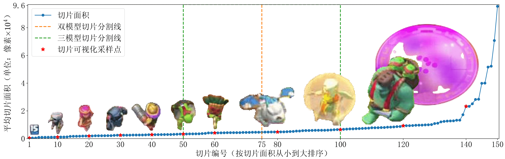

# 皇室战争图像数据集
> 本数据集不包含任何视频数据，视频数据来源于YouTube或自行录制的视频。

中文 | [English](README_en.md)

## 效果
### 切片数据集
本数据集收集了总共154个类别（全部切片名称请见[`label_list.py`](https://github.com/wty-yy/KataCR/blob/master/katacr/constants/label_list.py)），总计4654个切片，用于制作生成式数据集。

    
    
    
    
    
    
    
    
    

    
    
    
    
    
    
    
    
    

    
    
    
    
    
    
    
    
    

### 生成式数据集
使用[`generator.py`](https://github.com/wty-yy/KataCR/blob/master/katacr/build_dataset/generator.py)生成，用于[YOLOv8](https://github.com/ultralytics/ultralytics)训练。

    
    

### 卡牌数据集
本数据集只收集了2.6快速猪卡组的图片。

    
    
    
    
    
    
    
    
    
    

### 圣水数据集
本数据集只收集了5种圣水数字，用于对目标识别结果进行细分。

    
    
    
    
    

## 介绍及使用方法
本数据集**代码均位于[`KataCR`](https://github.com/wty-yy/KataCR)**中，
下面提到的代码均在`KataCR`项目下，
其中包含对**数据集标签进行转换**以及**生成式数据集的生成代码**，
本数据集中包含如下四个子数据集：
1. [人工标记目标识别图像数据集](/images/part2/)：
  文件路径格式为`part2/对局视频名称/回合数`，
  使用[Labelme](https://github.com/labelmeai/labelme)打开子文件夹，即可对边界框进行编辑。每个子文件夹中包含如下文件（`frame`为视频中的帧数）：
    - `frame.jpg`：目标识别图像。
    - `frame.json`：Labelme记录的边界框信息。
    - `frame.txt`：将`json`文件转为用于YOLO模型训练的`txt`文件，使用[`label_builder.py`](https://github.com/wty-yy/KataCR/blob/master/katacr/build_dataset/label_builder.py)生成。
      - 每行的格式为`类别 边界框相对中心坐标(x,y) 边界框相对宽高(w,h) 从属类别 6个0`

2. [生成式数据集](/images/segment/)：
  - 文件路径格式`segment/cls_name/{cls_name}_{bel}_id.png`：
    - `cls_name`为切片类别名称（全部切片名称请见[`label_list.py`](https://github.com/wty-yy/KataCR/blob/master/katacr/constants/label_list.py)）
    - `bel`为类别的从属派别
    - `id`为图片编号
  - 生成式数据集使用方法：
    1. 配置[`constant.py`](https://github.com/wty-yy/KataCR/blob/master/katacr/build_dataset/constant.py)中的`path_dataset`路径到`Clash-Royale-Dataset`文件夹下。
    2. 运行[`generator.py`](https://github.com/wty-yy/KataCR/blob/master/katacr/build_dataset/generator.py)后会在`KataCR/logs/generation`文件夹下生成目标识别图像以及带有标签的目标识别图像。（配置文件在`generator.py`最底部和[`generator_config.py`](https://github.com/wty-yy/KataCR/blob/master/katacr/build_dataset/generation_config.py)文件中）
  - YOLOv8训练方法：请见...

3. [卡牌分类](/images/card_classification/)：
  - 文件路径格式`card_classification/card_name/id.jpg`：
    - `card_name`为卡牌名称
    - `id`为图片编号

4. [圣水分类](/images/card_classification/)：
  - 文件路径格式`elixir_classification/cls_name/id.jpg`：
    - `cls_name`为圣水数字名称
    - `id`为图片编号
