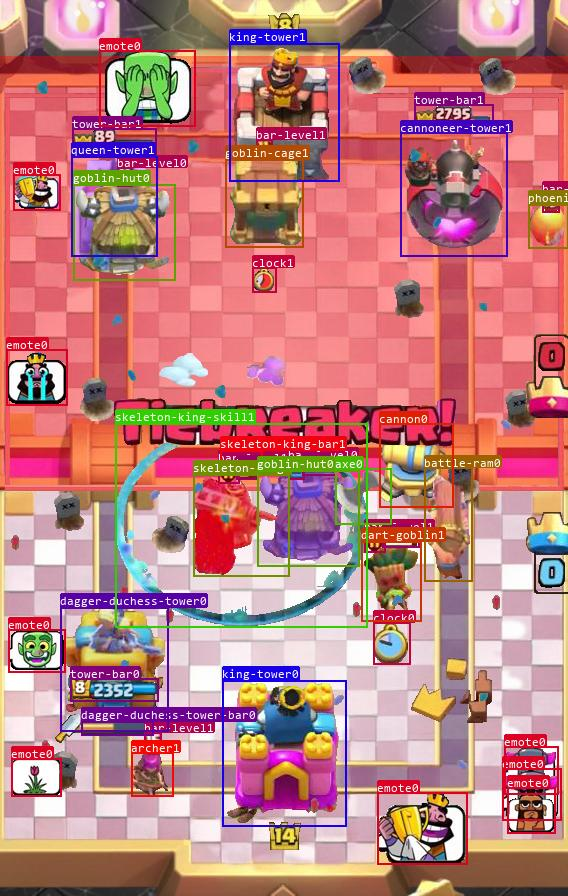

# Clash Royale Image Dataset
> This dataset does not contain any video data. Video data is sourced from YouTube or self-recorded videos.

[中文](README.md) | English

## Overview
### Sliced Dataset
This dataset collects a total of 154 categories (see [`label_list.py`](https://github.com/wty-yy/KataCR/blob/master/katacr/constants/label_list.py) for all sliced names), totaling 4654 slices, used to create generative datasets.

    
    
    
    
    
    
    
    
    

    
    
    
    
    
    
    
    
    

    
    
    
    
    
    
    
    
    

### Generative Dataset
Generated using [`generator.py`](https://github.com/wty-yy/KataCR/blob/master/katacr/build_dataset/generator.py), for training with [YOLOv8](https://github.com/ultralytics/ultralytics).

    
    

### Card Dataset
This dataset only collects images of the 2.6 Hog Cycle deck.

    
    
    
    
    
    
    
    
    
    

### Elixir Dataset
This dataset only collects images of 5 different elixir numbers, used for further classification of target recognition results.

    
    
    
    
    

## Introduction and Usage
All codes related to this dataset are located in [`KataCR`](https://github.com/wty-yy/KataCR),
The following codes are under the `KataCR` project,
which includes **label conversion for dataset** and **generation code for generative dataset**.
This dataset contains four sub-datasets:
1. [Manually labeled target recognition image dataset](/images/part2/):
  File path format is `part2/match_video_name/round number`,
  Open the subfolder using [Labelme](https://github.com/labelmeai/labelme) to edit the bounding box. Each subfolder contains the following files (with `frame` being the number of frames in the video):

- `frame.jpg`: Target recognition image.
- `frame.json`: Bounding box information recorded by Labelme.
- `frame.txt`: Convert the `json` file to a `txt` file for YOLO model training, generated using [`label_builder.py`](https://github.com/wty-yy/KataCR/blob/master/katacr/build_dataset/label_builder.py).
  - The format of each line is `category relative coordinates of the bounding box center (x, y) relative width and height (w, h) affiliated category 6 zeros`.

2. [Generative dataset](/images/segment/):
  - File path format `segment/cls_name/{cls_name}_{bel}_id.png`:
    - `cls_name` is the sliced category name (see [`label_list.py`](https://github.com/wty-yy/KataCR/blob/master/katacr/constants/label_list.py) for all sliced names)
    - `bel` is the category's affiliated faction
    - `id` is the image number
  - Usage of generative dataset:
    1. Configure the `path_dataset` path in [`constant.py`](https://github.com/wty-yy/KataCR/blob/master/katacr/build_dataset/constant.py) to the `Clash-Royale-Dataset` folder.
    2. Run [`generator.py`](https://github.com/wty-yy/KataCR/blob/master/katacr/build_dataset/generator.py) to generate target recognition images and labeled target recognition images in the `KataCR/logs/generation` folder. (Configuration files are at the bottom of `generator.py` and in [`generator_config.py`](https://github.com/wty-yy/KataCR/blob/master/katacr/build_dataset/generation_config.py))
  - YOLOv8 training method: see...

3. [Card Classification](/images/card_classification/):
  - File path format `card_classification/card_name/id.jpg`:
    - `card_name` is the name of the card
    - `id` is the image number

4. [Elixir Classification](/images/card_classification/):
  - File path format `elixir_classification/cls_name/id.jpg`:
    - `cls_name` is the name of the elixir number
    - `id` is the image number