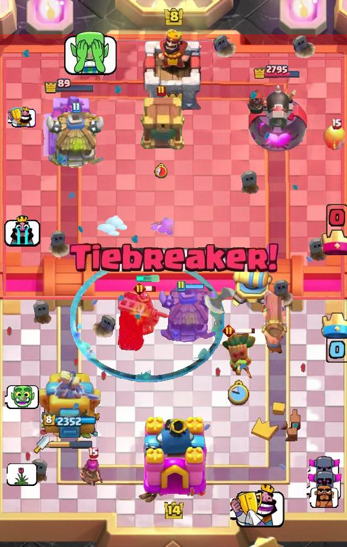

# Clash Royale Dataset

This dataset is specially designed to extract the image feature in game Clash Royale, including object detection (visual object classes, VOC), optical character recognition (OCR) and card classification.

> This dataset is building...

## Dataset struct

### Images

- `/images/part2`: Crop the middle main part of the origin image for the **Arena**.
- `/version_info`: Memory informations for every dataset version and change between the neighbor version.

```bash
CR/images/part{1,2,3}/video_name/episode/frame.jpg
```

#### Object Detection
**Undone, Working on**
```bash
# Associate with `CR/images/part2`
CR/images/part2/video_name/episode/frame.txt
```
The following figures are generated by [KataCR Data Generator](https://github.com/wty-yy/KataCR/blob/master/katacr/build_dataset/generator.py)
<div style="display: flex; flex-wrap: nowrap; justify-content: space-between;">
    
    
</div>
#### Classification

- Card classification: [/images/card_classification](/images/card_classification)
- Elixir classification: [/images/elixir_classification](/images/elixir_classification)

## Bounding box label definition

### Cards & Units

Until 2023/10/30, there are 116 different cards in Royale (include evolution cards). Card names can be found at [`katacr/constants/card_list.py`](https://github.com/wty-yy/KataCR/blob/master/katacr/constants/card_list.py).

But the card name is not completely, because the unit for different card could be same. So, we use unit name to distinguish different units, they can be found at [`katacr/constants/label_list.py`](https://github.com/wty-yy/KataCR/blob/master/katacr/constants/label_list.py). There are $127$ different units in Royale (include card unit, `queen-tower`, `king-tower`, 13 spells and 3 objects, see detail state).

#### Detail state

We add 1 types of states for each detection object，1 is predicted by YOLO, 2 are constants.

```vim
# Need predict:
blong:				0/1  # firend/enermy after card name
```

- `object`: 
  - Spells (13): `zap`, `giant-snowball`, `rage`, `the-log`, `arrows`, `earthquake`, `clone`, `tornado`, `fireball`, `freeze`, `poison`, `rocket`, `lightning`
  - Others: `dirt`(`miner`, `goblin-drill`, `mighty-miner`), `bowl`(`bowler`), `axe`(`executioner`)

### Bar

There are three types of bar in Royale:

- `tower-bar`: The health bar of queen tower.
- `king-tower-bar`: The health bar of king tower.
- `bar`: The bar of card unit.

### Others

- `selected`: The card is selected. (translucent state)
- `clock`: The little clock when card is deployed.
- `emote`: Just emotes were sent by players.
- `text`: All the text, such as `Good luck!`, `FIGHT!`, etc.
- `elixir`: When deploy a unit, there will appear a elixir with the cost.
- `evolution-symbol`: The purple diamond symbol appears when enemy evolution units are deployed.

